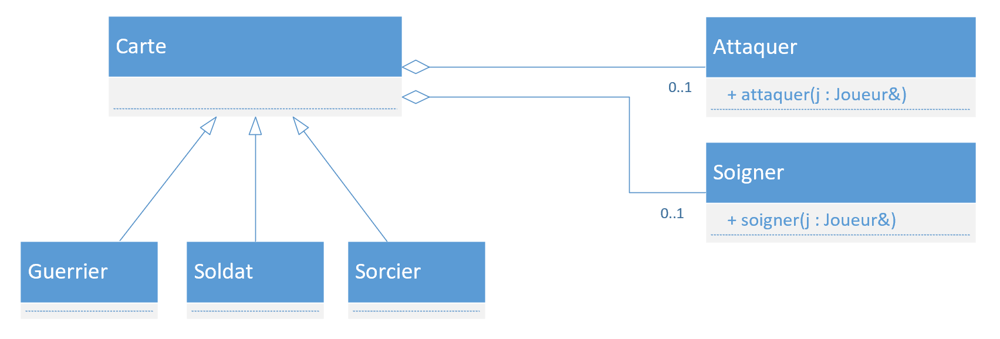
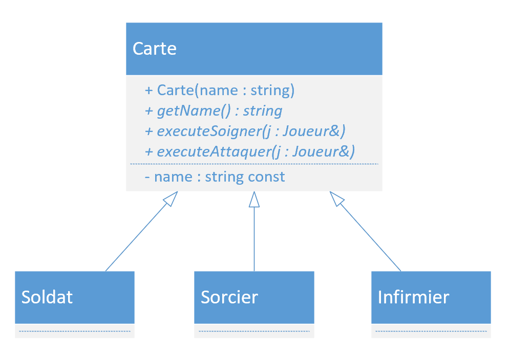

# Architecture logiciel

## Description
Le but de cet exercice est d'analyser l'architecture proposée pour le laboratoire `carte` est de voir si l'on pourrait mieux faire.

Il faut trouver une architecture pour le code afin de le rendre modulaire, évolutif et la maintenance du code doit être facile.

## But
Pour chacune des trois solutions ci-dessous, faite une analyse pour savoir si c'est une bonne approche.

La proposition peut-être un bon début mais qui doit être améliorée.

Voici quelques exemple des questions qui pourrait vous aider.

- Est-ce que c'est une bonne solution pour le jeu ? 
- Quel sont les avantages de cette solution
- Quel sont les inconvénients de cette solution
- Est-ce que c'est une bonne solution pour la maintenabilité du code ?
- Est-ce que c'est une solution adaptée pour faire évoluer le code ?
- Est-ce que l'on peut facilement modifier ou ajouter des types de cartes ?
- Comment améliorer la solution ?
- ...

## Présentation
Chaque groupe désignera un membre de l'équipe pour présenter son analyse devant la classe.

## Solution 1 - Séparation des actions

Dans cette solution, les actions ne sont pas héritées mais liées par `agrégation`.

## Solution 2 - Moins de classe

Dans cette implémentation, le code est déplacé dans la classe `Carte` pour simplifier l'architecture.

## Solution 3 - Actuelle

Analyser la solution qui a été implémentée au laboratoire.

## Bonus
Trouver une meilleures solutions que les trois proposées.
