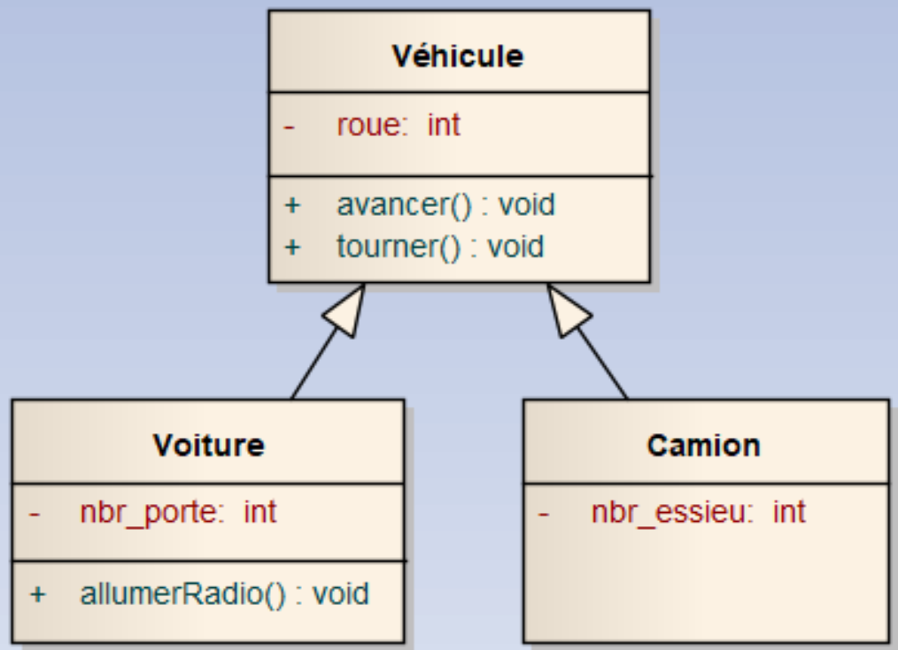

## Ex 1

Est-ce que le programme ci-dessous est-correct ?
Quel est l'affichage du programme ?

```CPP
class C1 {
   public:
    void afficher();

   protected:
    int val;
};

void C1::afficher() { cout << "Val : " << val << endl; }

class C2 : public C1 {
   public:
    C2() { val = 4; }
};

void ex1() {
    C2 c;
    c.afficher();
    c.val = 2;
    c.afficher();
}
```

## Ex 2

Quel est l'affichage du programme suivant :
```C++
struct Parent{
    Parent(){
        cout << "Aff : A" << endl;
    }
    Parent(int a){
        cout << "Aff : B" << endl;
    }
};

struct Enfant : public Parent{
    Enfant(){
        cout << "Aff : C" << endl;
    }
    Enfant(int a){
        cout << "Aff : D" << endl;
    }
    Enfant(int a, int b) : Parent(a){
        cout << "Aff : E" << endl;
    }
    Enfant(double a) : Parent(a){
        cout << "Aff : F" << endl;
    }
};

void ex2(){
    cout << "Exercice 2" << endl;
    cout << "E1" << endl;
    Enfant e1;
    cout << "p1" << endl;
    Parent p1(12);
    cout << "E2" << endl;
    Enfant e2(1,2);
    cout << "E3" << endl;
    Enfant e3(5.3);
    cout << "E4" << endl;
    Enfant e4(2);
}
```

## Ex 3

Implémenter les classes `Vehicule` et `Voiture` de l'image suivante :



Le nombre de roue est affecté pendant la construction des classes enfants.

Dans les méthodes, il faut juste afficher un texte.

Vous devez pouvoir exécuter le main suivant 

```CPP
void ex3()
{
    cout << "Exercice 2" << endl << endl;
    Voiture v;
    v.avancer();
    v.tourner();
}
```
